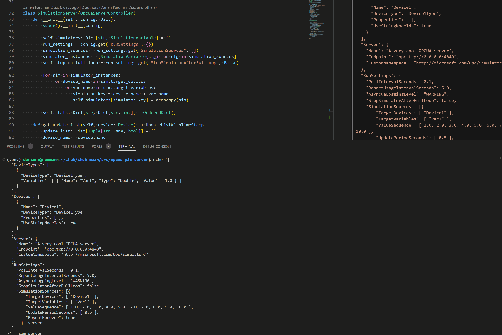

# OPC UA Eclipse Servers

This subproject implements OPC UA servers to cover the following use cases:

- Reads data from Rockwell PLCs used in both magnemotion and fluid demos
- Is capable of recording and replaying real-time data
- Exposes a test harness that can start and stop an OPCUA server with simulated data points
- The OPCUA server uses the DI companion spec and models device types and device instances as defined in configuration

The project is written in Python leveraging [asyncua](https://github.com/FreeOpcUa/opcua-asyncio) library. The code has been developed and tested in Python 3.10. To read PLC tags from the Rockwell PLC we use [pylogix](https://github.com/dmroeder/pylogix), which implements the TCP protocol to read/write PLC tags on port 44818.

To use this package, simply call `pip3 install <path/to/this/directory>` or `pip3 install .` if you are already in this directory. This will install the package in your current Python environment and will make available the following commands:

| Command | Purpose
| --------- | --------------|
| `plc_server <config.json>` | See `fluid-demo-real.json` for a sample configuration of a PLC |
| `sim_server <config.json>` | See `tests/data/simulator3.json` for a sample configuration |
| `test_harness` | Convenient test harness REST API on port 8000 that exposes endpoints to start and stop an OPCUA server in simulation mode with the configuration specified. Sample requests can be found in `tests/data/sample-requests.http` |

All application configuration options (loaded as JSON either from a file or STDIN) are documented in `eclipse_opcua/config_types.py`. The best way to get started is to look into existing configurations and adjust it as needed.

## SAMPLE USE CASE: How do I simulate one device with with one data point changing twice per second?

Here's an example running one device with one variable

```bash
echo '{
  "DeviceTypes": [
    {
      "DeviceType": "Device1Type",
      "Variables": [ { "Name": "Var1", "Type": "Double", "Value": -1.0 } ]
    }
  ],
  "Devices": [
    {
      "Name": "Device1",
      "DeviceType": "Device1Type",
      "UseStringNodeIds": true
    }
  ],
  "Server": {
    "Name": "A very cool OPCUA server",
    "Endpoint": "opc.tcp://0.0.0.0:4840",
    "CustomNamespace": "http://microsoft.com/Opc/Simulator/"
  },
  "RunSettings": {
    "PollIntervalSeconds": 0.1,
    "ReportUsageIntervalSeconds": 5.0,
    "AsyncuaLoggingLevel": "WARNING",
    "StopSimulatorAfterFullLoop": false,
    "SimulationSources": [{
        "TargetDevices": [ "Device1" ],
        "TargetVariables": [ "Var1" ],
        "ValueSequence": [ 1.0, 2.0, 3.0, 4.0, 5.0, 6.0, 7.0, 8.0, 9.0, 10.0 ],
        "UpdatePeriodSeconds": [ 0.5 ],
        "RepeatForever": true
      }]
  }
}' | sim_server
```



## Getting started with the code

The script `ci.sh` sets up a local python environment, runs formatting checks, checks for linting issues and run existing unit tests.

```bash
./ci.sh
```

The following commands are useful during developer workflows:
| Command | Purpose
| --------- | ------------
| `black .` | formats all your code with `black` formatter
| `pylint eclipse_opcua` | checks for style issues in the (production) source code
| `pytest tests` | runs all available unit/integration tests

## Consuming the package directly from Azure DevOps source code

The package can be easily installed in any system with Python and Pip in it. You will need to have your SSH key uploaded in Azure DevOps for this to work of course since this is a private repository.

```bash
python -m pip install 'eclipse_opcua @ git+ssh://git@ssh.dev.azure.com/v3/ISE-Industrial-Engineering/Industrial%20Metaverse%20-%20Software%20Delivery/Industrial%20Metaverse%20-%20Software%20Delivery@main#subdirectory=src/opcua-plc-server'
```
